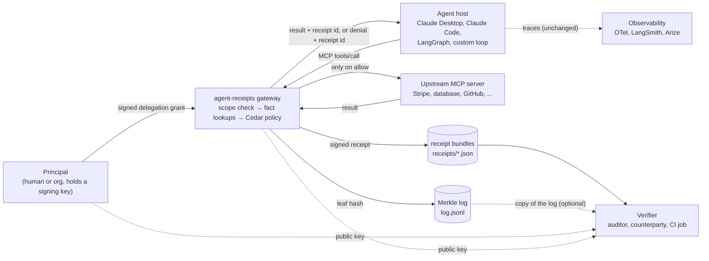
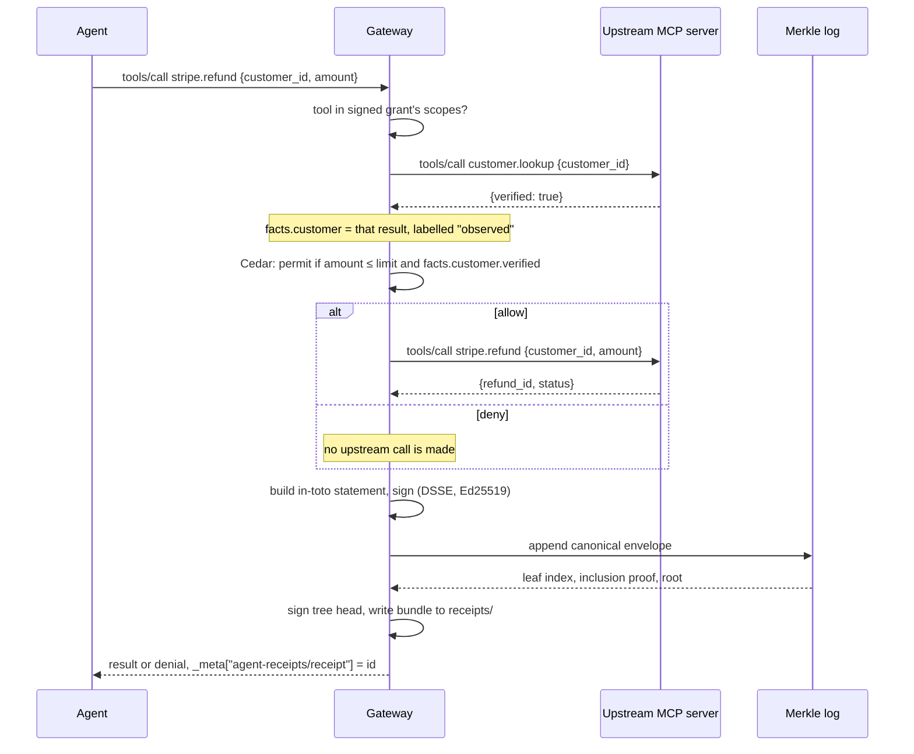
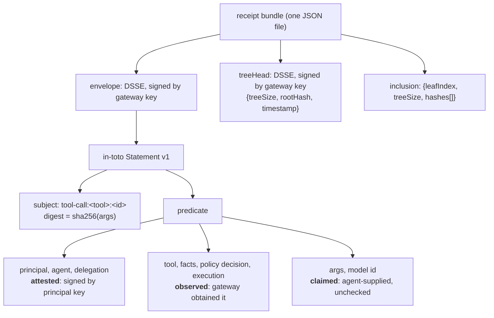

# agent-receipts

Signed, independently verifiable receipts for AI agent tool calls.

An MCP gateway sits between an agent and the systems it can affect. For every tool call, allowed or denied, it checks a delegation grant signed by the human principal, gathers the facts the policy needs by calling upstream itself, evaluates a Cedar policy that fails closed, forwards the call only on allow, and emits a signed receipt appended to a Merkle transparency log. Anyone holding the public keys can verify a receipt offline.

The agent is not trusted. The layer around it is, and the receipt says exactly how far that trust extends.

- [Usage guide](docs/usage.md): setup, wiring into Claude Desktop, Claude Code, or your own agent loop
- [Writing policies](docs/policies.md): how a tool call becomes a Cedar request, with tested examples
- [Verifying a receipt](docs/verification.md): what each check means and what a verified receipt does and does not prove

## How it fits together



Three parties hold keys. The **principal** signs a grant saying which agent may use which tools until when. The **gateway** signs every receipt and every tree head. The **verifier** holds only public keys and needs no access to the gateway, the agent, or the upstream system.

## One tool call, end to end



Denied calls get receipts too. "The agent tried to pay out funds and was refused" is evidence worth keeping.

## Anatomy of a receipt bundle



Every field carries a provenance label. This is the design decision that matters most, and it is what a verifier reads back.

| provenance | meaning | today's examples |
| --- | --- | --- |
| `attested` | signed by a key other than the gateway's | principal id, agent id, the delegation grant |
| `observed` | the gateway obtained it deterministically itself | upstream tool results, fact lookups, the policy decision, execution status |
| `claimed` | originated from the agent or model, no independent check | tool arguments, the model id |

## Quick start

```bash
bun install        # or pnpm / npm
npm run demo       # keys, grant, policy, four tool calls, verification, a tampering attempt
npm test
```

The demo leaves everything in `demo-out/`. Verify a receipt by hand:

```bash
node src/cli.ts verify demo-out/receipts/<id>.json \
  --gateway-key demo-out/keys/gateway.pub \
  --principal-key demo-out/keys/principal.pub \
  --log demo-out/log.jsonl
```

Exit code 0 means every check passed. See [docs/verification.md](docs/verification.md) for what the report means.

## What a receipt proves, and what it does not

| claim | verifier | adversary | mechanism | status |
| --- | --- | --- | --- | --- |
| receipt was not altered after issue | anyone | later editor | DSSE signature over canonical JSON | done |
| receipt was issued in sequence, none removed | auditor with a log copy | operator rewriting history | Merkle inclusion proof + recomputed root | done |
| the principal really delegated this scope to this agent | anyone with the principal's key | operator, agent | grant signed by principal key, checked for scope and validity window | done |
| the policy decision was made against this exact policy | anyone | operator swapping policies | sha256 of policy text in the receipt | done |
| facts the policy relied on were not asserted by the agent | anyone reading the receipt | agent | facts fetched by the gateway, recorded with their own digests, labelled `observed` | done |
| the upstream system actually executed the action | third party | operator | needs the upstream's own signed response embedded verbatim | **not done**, depends on the tool provider |
| the operator itself cannot mint a false receipt | regulator, counterparty | operator | needs a TEE-hosted signer or a federated log | **not done** |
| which model produced the call | anyone | operator | no hosted provider signs model identity | **not possible today**, labelled `claimed` |

If a vendor tells you their receipts prove more than the first five rows, ask them which key signed it.

## Layout

```
src/crypto.ts      canonical JSON, sha256, Ed25519 keys, DSSE sign/verify
src/log.ts         Merkle log: append, root, inclusion proof, verify, JSONL persistence
src/policy.ts      Cedar evaluation wrapper, fail-closed
src/delegation.ts  signed delegation grants
src/receipt.ts     receipt statement types and provenance labels
src/gateway.ts     the MCP proxy: scope check, facts, policy, forward, receipt
src/verify.ts      offline verification and the human-readable report
src/cli.ts         keygen, grant, gateway, verify
scripts/           fake Stripe upstream, fixture builder, demo
test/              unit tests per module and an end-to-end gateway test
docs/              usage, policies, verification
```

## Roadmap, in the order it pays off

1. Embed upstream signed responses (Stripe webhook signatures, GitHub delivery signatures) so execution can move from `observed` to `attested`.
2. OpenTelemetry span ids on receipts so existing observability links to them.
3. Consistency proofs between tree heads, so an auditor can check that a later log extends an earlier one.
4. Delegation chains for sub-agents.
5. Receiver-attested receipts for agent-to-agent calls.
6. A TEE-hosted signer, then SD-JWT redaction, then ZK proofs of policy compliance. Not before.
