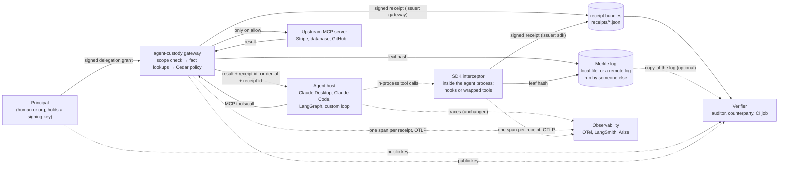
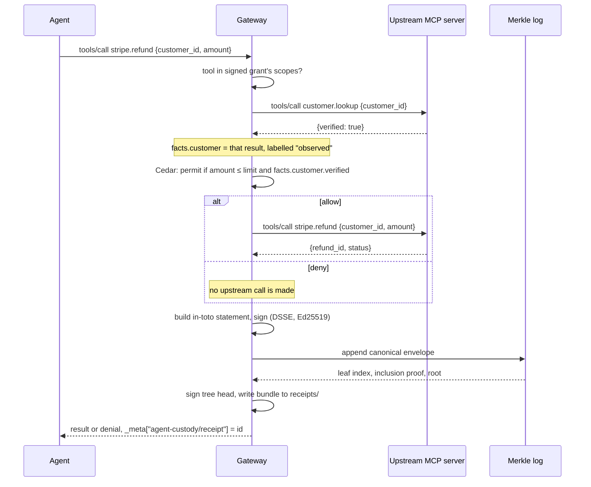
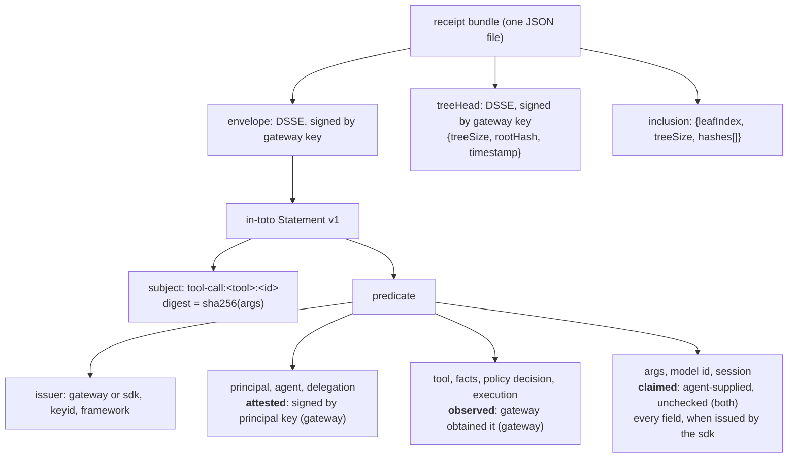

# agent-custody

Chain of custody for AI agents: signed, independently verifiable receipts for every tool call.

Two producers, one receipt format, one verifier.

- **The gateway** is an MCP proxy between an agent and the systems it can affect. For every tool call, allowed or denied, it checks a delegation grant signed by the human principal, gathers the facts the policy needs by calling upstream itself, evaluates a Cedar policy that fails closed, forwards the call only on allow, and emits a signed receipt appended to a Merkle transparency log.
- **The SDK** is an interceptor inside the agent's own process, hooked into the framework's tool-call callbacks: Claude Code, the Claude Agent SDK, the OpenAI Agents SDK, the Vercel AI SDK, LangChain, or any function you wrap. It reaches everything the gateway cannot see and issues the same receipts, labelled as self-reported.

Anyone holding the public keys can verify a receipt offline. The agent is not trusted. The layer around it is, and the receipt says exactly how far that trust extends, starting with who issued it.

- [Tutorials](docs/tutorials.md): eighteen runnable examples, one per aspect of the code, all executed by the test suite
- [Usage guide](docs/usage.md): gateway setup, wiring into Claude Desktop, Claude Code, or your own agent loop
- [The interceptor SDK](docs/sdk.md): Claude Code hooks, the Claude Agent SDK, adapters for the OpenAI Agents SDK, Vercel AI SDK and LangChain, and wrapping tool functions in anything else
- [Writing policies](docs/policies.md): how a tool call becomes a Cedar request, with tested examples
- [Verifying a receipt](docs/verification.md): what each check means and what a verified receipt does and does not prove

## Getting started

```bash
npm install @agent-custody/receipts        # or bun add, pnpm add
```

Published on npm as [`@agent-custody/receipts`](https://www.npmjs.com/package/@agent-custody/receipts): compiled JavaScript with type declarations, Node 22 or later, Apache-2.0.

Record receipts from inside your own agent, no gateway needed. Generate a signing key, point a config at it, wrap the functions the agent calls:

```bash
npx agent-custody keygen --dir keys --name app
```

```json
{ "agentId": "billing-bot", "identity": { "keyFile": "keys/app.key" }, "receiptsDir": "receipts", "logFile": "log.jsonl" }
```

```ts
import { createSdkIssuer, loadSdkConfig, loadPublicKey, verifyBundle } from "@agent-custody/receipts";

const issuer = createSdkIssuer(loadSdkConfig("./sdk.json"));
const refund = issuer.wrap("stripe.refund", async (args: { amount: number }) => stripe.refund(args));
await refund({ amount: 5000 });                 // one signed receipt in receipts/, one leaf in log.jsonl

const bundle = JSON.parse(readFileSync("receipts/<id>.json", "utf8"));
verifyBundle(bundle, { issuerKeys: [loadPublicKey("keys/app.pub")], logFile: "log.jsonl" }).ok;   // true
```

Framework hooks and adapters, including Claude Code, the OpenAI Agents SDK, the Vercel AI SDK and LangChain, are in [docs/sdk.md](docs/sdk.md). To enforce rather than record, put the gateway between the agent and its tools: `npx agent-custody gateway --config gateway.json`, set up in [docs/usage.md](docs/usage.md).

## How it fits together



Three parties hold keys. The **principal** signs a grant saying which agent may use which tools until when. The **issuer**, gateway or SDK, signs every receipt and every tree head. The **verifier** holds only public keys and needs no access to the issuer, the agent, or the upstream system.

## Two producers, one receipt

| | gateway | SDK |
| --- | --- | --- |
| where it runs | separate process between agent and tools | inside the agent's process |
| what it sees | MCP tool calls | whatever the framework's hooks expose |
| enforcement | yes, denied calls never reach upstream | only where a hook can block |
| provenance of its fields | `attested` and `observed` | `claimed`, all of them |
| what a verifier learns | the agent could not skip or forge this | the agent's process reported this and it has not changed since |
| install | one line in the host's MCP config | a hook entry or a wrapped function |

Every receipt names its issuer, and the verifier prints what that issuer kind is worth before anything else. A dashboard full of `sdk` rows is the reason to route the consequential calls through the gateway.

### Supported hosts and frameworks

| host or framework | producer | enforce + record | record only | tested against |
| --- | --- | --- | --- | --- |
| any MCP host: Claude Desktop, Claude Code, Cursor, custom | gateway | yes | | a real MCP client and upstream over stdio |
| Claude Code | SDK | `hook` command, PreToolUse deny | PostToolUse | the documented hook contract, via stdin |
| Claude Agent SDK | SDK | `claudeAgentHooks` | same | the same handler |
| OpenAI Agents SDK (JS) | SDK | `wrapTools` | `observeRunner` | a real `Runner` with a scripted model |
| Vercel AI SDK | SDK | `wrapTools` | | a real `generateText` loop over the SDK's mock model |
| LangChain / LangGraph (JS) | SDK | `tool(issuer.wrap(fn))` | `ReceiptCallbackHandler` | real `StructuredTool` invocations |
| anything else | SDK | `issuer.wrap(name, fn)` | `issuer.record` | plain functions |
| Python: LangChain, OpenAI Agents SDK, Claude Agent SDK | sidecar + [Python package](../python/README.md) | `wrap_tools`, `claude_hook` PreToolUse deny, `client.wrap` | `ReceiptCallbackHandler` | the real Python packages, receipts checked by this verifier |
| Go, Java, Rust, any language with HTTP | sidecar | decide then record | record | [examples/languages](examples/languages), each run against a live sidecar |
| any MCP host in any language: Claude Agent SDK Python, OpenAI Agents Python | gateway | yes | | the gateway is an MCP server; [usage.md](docs/usage.md#python-hosts) |
| any REST API, as tools the agent reaches through the gateway | gateway, `rest` upstream | yes | | a stand-in HTTP API; [usage.md](docs/usage.md#setup-step-by-step) |

The framework packages are optional peer dependencies. Each adapter imports only from its own package.

## One tool call, end to end



Denied calls get receipts too. "The agent tried to pay out funds and was refused" is evidence worth keeping.

## Anatomy of a receipt bundle



Every field carries a provenance label. This is the design decision that matters most, and it is what a verifier reads back.

| provenance | meaning | today's examples |
| --- | --- | --- |
| `attested` | signed by a key other than the issuer's | principal id, agent id, the delegation grant (gateway receipts) |
| `observed` | the issuer obtained it deterministically, outside the agent's control | upstream tool results, fact lookups, the policy decision, execution status (gateway receipts) |
| `claimed` | originated from the agent, the model, or the agent's own process, no independent check | tool arguments, the model id, session ids, and every field of an SDK receipt |

## Quick start

```bash
bun install                              # from the repository root, once for the workspace
cd packages/receipts
node scripts/demo.ts                     # gateway: keys, grant, policy, four tool calls, verification, a tampering attempt; then the SDK wrapping the same tool
node examples/01-keys-and-signing.ts     # first of eighteen step-by-step examples, see docs/tutorials.md
bun run test                             # this package; `bun run test` at the root runs every package
```

Everything runs on plain Node 22 or later. No build step, no `npx`, no `tsx` needed on the command line.

The demo leaves everything in `demo-out/`, including receipts from both producers. Verify a receipt by hand:

```bash
node src/cli.ts verify demo-out/receipts/<id>.json \
  --issuer-key demo-out/keys/gateway.pub \
  --principal-key demo-out/keys/principal.pub \
  --log demo-out/log.jsonl
```

Exit code 0 means every check passed. See [docs/verification.md](docs/verification.md) for what the report means.

To issue receipts from your own agent code, without a gateway:

```ts
import { loadSdkConfig } from "./src/config.ts";
import { createSdkIssuer } from "./src/sdk/index.ts";

const issuer = createSdkIssuer(loadSdkConfig("./sdk.json"));
const refund = issuer.wrap("stripe.refund", async (args: { amount: number }) => stripe.refund(args));
```

[docs/sdk.md](docs/sdk.md) has the config file and the per-framework adapters.

## What a receipt proves, and what it does not

| claim | verifier | adversary | mechanism | status |
| --- | --- | --- | --- | --- |
| receipt was not altered after issue | anyone | later editor | DSSE signature over canonical JSON | done |
| receipt was issued in sequence, none removed | auditor with a log copy | operator rewriting history | Merkle inclusion proof + recomputed root | done |
| the principal really delegated this scope to this agent | anyone with the principal's key | operator, agent | grant signed by principal key, checked for scope and validity window | done |
| the policy decision was made against this exact policy | anyone | operator swapping policies | sha256 of policy text in the receipt | done |
| facts the policy relied on were not asserted by the agent | anyone reading the receipt | agent | facts fetched by the gateway, recorded with their own digests, labelled `observed` | done |
| the side effect was committed to the log before it happened | anyone with a log copy | operator, log outage | for tools in `precommit`, a signed authorization logged first, embedded in the receipt with its leaf position, checked to precede the receipt | done |
| the upstream system actually executed the action | anyone with the upstream's key or the provider's secret | operator | the upstream signs its result for the receipt, or the provider's own delivery signature (Stripe, GitHub) is embedded and checked | done, for upstreams that sign |
| the operator itself cannot mint a false receipt | regulator, counterparty | operator | needs a TEE-hosted signer or a federated log | **not done** |
| which model produced the call | anyone | operator | no hosted provider signs model identity | **not possible today**, labelled `claimed` |
| an SDK receipt reflects what the tool really did | anyone | agent's own process | none; the SDK shares a process with the agent | **by design not claimed**; issuer kind `sdk` says so |

If a vendor tells you their receipts prove more than the first five rows, ask them which key signed it.

## Layout

```
src/config.ts      gateway and SDK config schemas, path resolution
src/crypto.ts      canonical JSON, sha256, Ed25519 keys, DSSE sign/verify
src/log.ts         Merkle log: append, root, inclusion and consistency proofs, verify, JSONL persistence
src/log-sink.ts    where leaves go: the local file, or a remote log over HTTP; plus the reference log server
src/policy.ts      Cedar evaluation wrapper, fail-closed
src/delegation.ts  signed delegation grants
src/receipt.ts     receipt and authorization statement types and provenance labels
src/issue.ts       sign, log, and write a receipt, or commit an authorization first; shared by both producers
src/gateway.ts     the MCP proxy: scope check, facts, policy, forward, receipt
src/sdk/index.ts   the interceptor: policy decision, record, wrap(tool fn)
src/sdk/claude.ts  Claude Code command hook and Claude Agent SDK in-process hooks
src/sdk/openai-agents.ts, vercel-ai.ts, langchain.ts   framework adapters, tested against the real packages
src/sidecar.ts     the SDK issuer behind a local HTTP API, for agents in other languages
src/otel.ts        OpenTelemetry export: one OTLP/HTTP span per receipt, after the receipt, no SDK dependency
src/rest.ts        the REST connector: an HTTP API described as tools, standing where an MCP upstream stands
src/upstream.ts    attested execution: an upstream signs its result for the receipt; the verifier checks it with the upstream key
vectors/           conformance vectors: receipts, keys, logs, proofs, and expected verdicts; `bun run vectors` regenerates them
src/verify.ts      offline verification, the human-readable report, and the audit that a later log extends an earlier one
src/cli.ts         keygen, grant, gateway, hook, serve, log, prune, verify, audit
src/retention.ts   pruning the log: leaves become their hashes, bundles are removed, proofs survive
src/index.ts       the package's public surface; adapters are exported on ./sdk/<framework> subpaths
tsconfig.build.json  emits dist/ (JavaScript plus declarations) for consumers; the repo itself runs the .ts directly
scripts/           fake Stripe upstream (signs its results with --key), a second fake upstream, fixture builders for gateway and SDK, demo
examples/          eighteen runnable tutorials, plus examples/languages/: Python, Go, Java, and Rust clients of the sidecar, run by the test suite, one per aspect; each is run by the test suite
test/              unit tests per module, end-to-end gateway test, SDK and hook tests,
                   adapter tests against the real packages, and a test that runs every policy in docs/policies.md
docs/              tutorials, usage (gateway), sdk, policies, verification
```

## Plan

The design is two producers feeding one verifier. The SDK is the top of the funnel: cheap to install, wide reach, honest about being self-reported. The gateway is what a security or compliance owner mandates for consequential actions. Both exist; the work is widening each.

**Done**

- Gateway: MCP proxy, signed delegation, gateway-fetched facts, Cedar policy, denial receipts, Merkle log, offline verifier.
- Receipt schema carries the issuer kind, so a verifier reads gateway versus SDK before anything else.
- SDK core: policy decision, record, and a generic `wrap(tool, fn)` for any framework whose tools are functions.
- Claude Code command hook for PreToolUse, PostToolUse, and PostToolUseFailure, with blocking on deny.
- Claude Agent SDK in-process hooks over the same handler.
- Provider-native deliveries: an upstream wrapping Stripe or GitHub attaches the signed webhook or delivery for the call; a verifier with the shared secret checks the HMAC, the timestamp, and the binding to the result, and reports the execution as attested by shared secret.
- Logarithmic appends: the Merkle log caches complete subtrees, so issuing a receipt costs the same at the millionth leaf as at the first; measured at 0.15 ms per receipt and about half a millisecond per gateway call including policy, a fact lookup, and the upstream signature.
- Retention on the log: `prune` replaces leaves older than a cutoff with their hashes and removes their bundles, so proofs still verify and the content is gone.
- Several upstreams under one gateway and one grant, each tool owned by exactly one, with the receipt naming which served the call; consumed facts flow across them.
- Attested execution: an upstream that holds a key signs its result for the receipt, the gateway embeds it, and a verifier given the upstream key reports the execution as attested rather than observed. The memory server and the demo upstream sign.
- HTTP upstreams: the gateway reaches an already-running MCP server over Streamable HTTP with a bearer token from the environment, as well as spawning one over stdio.
- Optional fact lookups: a lookup that references a call argument the call does not carry is skipped rather than denying, so policy can see the fact a write is about to supersede without refusing writes that supersede nothing.
- Consumed facts: an upstream declares the facts it served in its result `_meta`, and every later gateway receipt in the session carries those ids as `consumed`, observed, so what the agent had been shown before each call is on the record.
- The forwarded call carries the receipt id and the attested agent and principal in `_meta`, so a stateful upstream can cite the receipt; the memory server in `@agent-custody/state` runs this way.
- Conformance vectors, generated by the test suite and published with the spec, and a browser verifier on agent-custody.dev that passes all of them.
- Sidecar: the SDK issuer behind a local HTTP API (`serve`), with a Python package on PyPI-ready footing and Go, Java, and Rust clients, so agents in any language get the same receipts from one signing implementation.
- Consistency proofs between tree heads (RFC 9162), served by the log and checked by the `audit` command, so an auditor holding an old tree head can prove nothing before it was rewritten.
- Remote log: the issuer can append to a log run by someone else over HTTP, whose key then signs the tree heads, so a verifier learns the receipt was in a log the operator could not rewrite. Includes the reference log server, bearer-token auth, and a root endpoint for auditors.
- Framework adapters, each tested against the real package with a scripted model and no network: OpenAI Agents SDK (`wrapTools` enforces, `observeRunner` records from lifecycle events), Vercel AI SDK (`wrapTools` over a real `generateText` loop), LangChain (`ReceiptCallbackHandler` records, `issuer.wrap` enforces).

- OpenTelemetry export: with `otel` in either config, every receipt is also one span at the collector the team already runs, trace id equal to the receipt id, attributes for tool, agent, principal, status, decision, and log position; after the receipt, best effort, never on the evidence path.
- The REST connector: a plain HTTP API described as tools in the gateway config, credentials from the environment, so an agent's direct API calls become receipted, policy-checked tool calls through the gateway.
- Pre-commit authorization for consequential tools: named in `precommit`, a call is signed and logged before it is forwarded, withheld if the log will not take it, and its receipt carries the committed authorization with proof that it precedes the execution.

**Next, in the order it pays off**

1. An HTTP transport for the gateway, with the grant presented per connection, for a shared deployment rather than one process per agent session.
2. Delegation chains for sub-agents.
3. Receiver-attested receipts for agent-to-agent calls.
4. A TEE-hosted signer, then SD-JWT redaction, then ZK proofs of policy compliance. Not before.

A Python SDK follows the same shape once the TypeScript adapters have settled.
